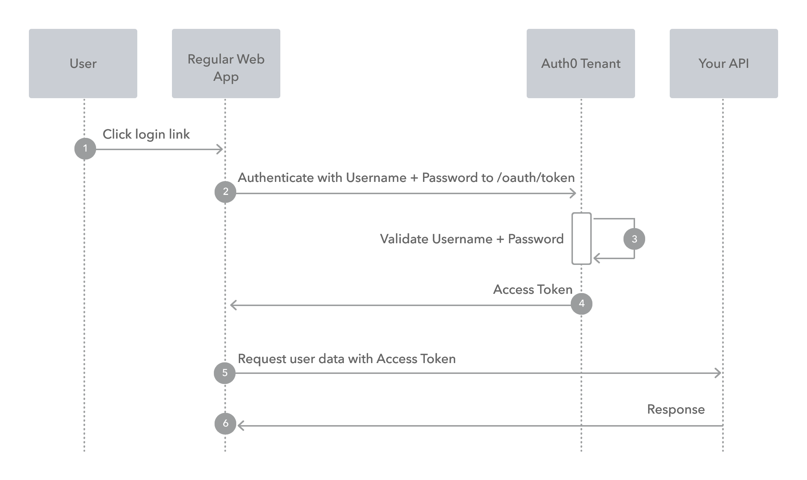

### Conceitos Básicos de Segurança:

* **Autenticação** - É o proceso pelo qual um usuário é confimado como sendo quem realmente diz ser. Para este processo podem ser usados diversos mecanismos, dentre os quais o mais comum é o usos de usuário e senha.
* **Autorização** - É o processo qual um usuário recebe autorização para acessar aos recursos configurados para ele.
* **OAuth2** - Padrão aberto de **autorização** que permite que aplicativos de terceiros acessem recursos de um usuário em servidores, sem exigir as credenciais do mesmo. Não trata da autenticação, apenas da autorização.
* **OpenID Connect** (OIDC) - Extenção sobre o Oauth 2.0 que adiciona a camada de **autenticação** de usuário.
* **JWT** (JSON Web Token) - Protocolo que utiliza tokens assinados digitalmente para transmitir informações sobre **autenticação** e **autorização** entre partes.
* **RBAC** (Role-Based Access Control) - Permissões atribuidas a papéis ("roles”), que estão associadas a usuários ou grupos.
* **ABAC** (Attribute-Based Access Control) - Permissões baseadas em atributos do usuário, do recurso ou do contexto. Ex.: Usuários do departamento X podem acessar o recurso Y apenas durante o horário comercial.
* **SSO** (Sigle Sign-On) - Método de **autenticação** que permite ao usuário acessar múltiplos sistemas, utilizando apenas um conjunto de credenciais. As principais vantagens do SSO são: praticidade, segurança e centralização.

### Termos e Atores Básicos no Protocolo OAuth2:

* **Resource Owner:** Entidade que pode conceder acesso a um **recurso protegido**. Tipicamente o usuário final
* **Client:** Aplicação solicitando acesso a um recurso protegido em nome do **proprietário do recurso** (Resource Owner).
* **Resource Server:** Servidor hospedando os **recursos protegidos**. Esta é a API que você deseja acessar.
* **Authorization Server:** Servidor que autentica o **proprietário do recurso** (Resource Owner) e emite **tokens de acesso** após obter a autorização adequada. Neste caso, Auth0.
* **User Agent:** Agente usado pelo **proprietário do recurso** (Resource Owner) para interagir com o **cliente** (por exemplo, um navegador ou um aplicativo nativo).

### O Keycloack Como Servidor de Identidade:

O Keycloak é uma solução de código aberto para gerenciamento de identidade e acesso (IAM), desenvolvida pela Red Hat, que permite autenticação e autorização centralizada para aplicativos e serviços modernos.

Uma de suas principais características está a capacidade de centralizar através de um único login, o acesso a múltiplos sistemas (SSO), simplificando os fluxos de autenticação e autorização.

### Flúxos de Autorização OAuth2

1. O Cliente é o Proprietário do Recurso [[Projeto 01](../oauth2-fluxo1)]

2. O Cliente é um aplicativo da web em execução no servidor [[Projeto 02](../oauth2-fluxo2)]

3. O Cliente é absolutamente confiável com as credenciais do usuário [[Projeto 03](../oauth2-fluxo3)]

4. O Cliente é um Aplicativo de Página Única (SPA - Single Page Application) [[Projeto 04 (obs. Parcial)](../oauth2-fluxo1)]

