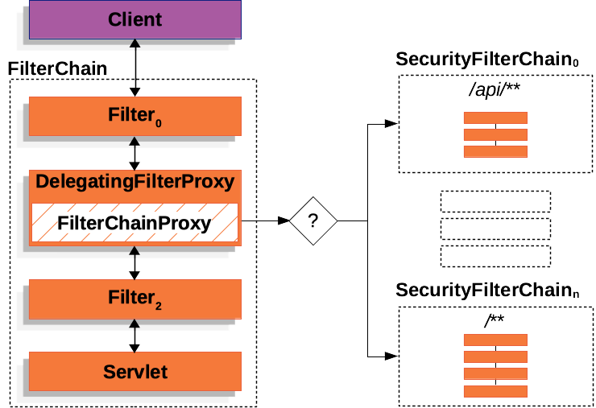
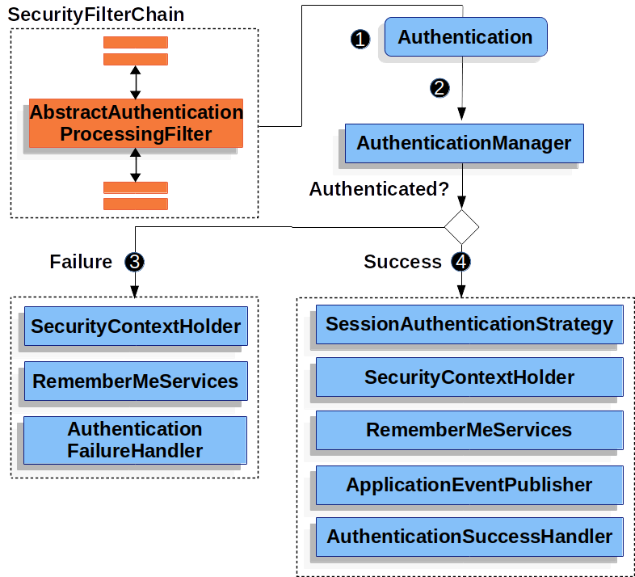

**Documentação Spring Security - Servlet Applications**

**Visão Geral**

O Spring Security para aplicações **Servlet** oferece uma arquitetura
robusta e flexível para autenticação e autorização. A documentação
oficial apresenta componentes fundamentais que trabalham em conjunto
para fornecer segurança abrangente a aplicações web baseadas em
servlets.

**I.** **Arquitetura Geral**

**Componentes Principais**

A arquitetura do Spring Security para aplicações servlet é baseada em
uma cadeia de filtros que interceptam e processam todas as requisições
HTTP antes que cheguem aos controllers da aplicação.



**1. DelegatingFilterProxy**

O **DelegatingFilterProxy** é o ponto de entrada do Spring Security no
mundo dos servlets. Este componente atua como uma ponte entre o
contêiner de servlets e o contexto de aplicação do Spring.

**Características principais:**

- Registrado como um filtro padrão do servlet container
- Delega todo o trabalho para um bean Spring que implementa a
  interface Filter
- Permite acesso às funcionalidades de injeção de dependência do
  Spring
- Realiza busca lazy dos beans de filtro para evitar problemas de
  inicialização

**Fluxo de funcionamento:**

```
public void doFilter(ServletRequest request, ServletResponse response,FilterChain chain) {
    Filter delegate = getFilterBean(someBeanName); // (1)
    delegate.doFilter(request, response); // (2)
}
```

**2. FilterChainProxy**

O **FilterChainProxy** é o componente central do Spring Security que
gerencia múltiplas cadeias de filtros de segurança. Ele é registrado
como um bean Spring e é invocado pelo DelegatingFilterProxy.

**Vantagens do FilterChainProxy:**

- Ponto de partida para todo suporte a servlets do Spring Security
- Limpa o SecurityContext para evitar vazamentos de memória
- Aplica o HttpFirewall para proteção contra ataques
- Permite determinação flexível de qual SecurityFilterChain deve ser
  invocada

**Funcionalidades:**

- Determina qual cadeia de filtros usar baseado em qualquer aspecto do
  HttpServletRequest
- Suporta múltiplas SecurityFilterChain para diferentes partes da
  aplicação
- Apenas a primeira cadeia correspondente é invocada

**3. SecurityFilterChain**

A **SecurityFilterChain** é usada pelo FilterChainProxy para determinar
quais filtros de segurança devem ser invocados para uma requisição
específica.

**Características:**

- Os filtros de segurança são tipicamente beans Spring
- Registrados com o FilterChainProxy em vez do DelegatingFilterProxy
- Cada cadeia pode ser única e configurada isoladamente
- Uma cadeia pode ter zero filtros se a aplicação quiser ignorar
  certas requisições

**II.**  **Fluxo de Autenticação**

**Componentes de Autenticação**

**1. SecurityContextHolder**

O **SecurityContextHolder** é onde o Spring Security armazena os
detalhes de quem está autenticado. Não importa como o
SecurityContextHolder é populado - se contém um valor, é usado como o
usuário atualmente autenticado.


**Exemplo de uso:**

```
SecurityContext context = SecurityContextHolder.createEmptyContext();
Authentication authentication = 
    new TestingAuthenticationToken("username", "password", "ROLE_USER");
context.setAuthentication(authentication);
SecurityContextHolder.setContext(context);
```

**2. SecurityContext**

O **SecurityContext** é obtido do SecurityContextHolder e contém o
objeto Authentication do usuário atualmente autenticado.

**3. Authentication**

A interface **Authentication** serve dois propósitos principais:

- Entrada para o AuthenticationManager fornecendo as credenciais do
  usuário
- Representa o usuário atualmente autenticado obtido do
  SecurityContext

**Contém:**

- principal: Identifica o usuário (frequentemente uma instância de
  UserDetails)
- credentials: Geralmente uma senha (limpa após autenticação)
- authorities: Instâncias de GrantedAuthority com permissões de alto
  nível

**4. GrantedAuthority**

**GrantedAuthority** representa permissões de alto nível concedidas ao
usuário. Exemplos incluem papéis como ROLE\_ADMINISTRATOR ou
ROLE\_HR\_SUPERVISOR.

**5. AuthenticationManager**

O **AuthenticationManager** é a API que define como os filtros do Spring
Security executam a autenticação. É uma interface com o método:

Authentication authenticate(Authentication authentication);

**6. ProviderManager**

**ProviderManager** é a implementação mais comum do
AuthenticationManager. Delega a responsabilidade de autenticação para
uma lista de AuthenticationProvider.

**Funcionamento:**

- Itera através de uma lista de AuthenticationProvider
- Para quando um provider retorna uma resposta não-nula
- Se nenhum provider autentica, lança ProviderNotFoundException
- Limpa credenciais do objeto Authentication retornado

**7. AuthenticationProvider**

**AuthenticationProvider** é usado pelo ProviderManager para executar
tipos específicos de autenticação. Possui dois métodos principais:

- authenticate(): executa a autenticação
- supports(): verifica se suporta o tipo de autenticação indicado

**8. UserDetailsService**

**UserDetailsService** é usado pelo DaoAuthenticationProvider para
recuperar username, password e outros atributos para autenticação.
Fornece um único método:

UserDetails loadUserByUsername(String username) throws
UsernameNotFoundException;

**Implementações disponíveis:**

- In-memory
- JDBC
- Caching implementations

**9. UserDetails**

**UserDetails** é retornado pelo UserDetailsService e validado pelo
DaoAuthenticationProvider. Contém informações como:

- Username e password
- Authorities (papéis)
- Status da conta (expirada, bloqueada, habilitada)

III.  **Fluxo de Processamento de Autenticação**

**AbstractAuthenticationProcessingFilter**



**AbstractAuthenticationProcessingFilter** é usado como filtro base para
autenticar credenciais do usuário. O fluxo típico inclui:

**Quando credenciais são submetidas:**

1. Cria um objeto Authentication a partir do HttpServletRequest
2. Authentication é passado para o AuthenticationManager
3. Se falha: SecurityContextHolder é limpo,
   AuthenticationFailureHandler é invocado
4. Se sucesso: Authentication é definido no SecurityContextHolder,
   AuthenticationSuccessHandler é invocado`<!-- -->`

**IV.**  **Tratamento de Eventos de Autenticação**

**Authentication Events**

O Spring Security dispara eventos para cada autenticação que sucede ou
falha:

- AuthenticationSuccessEvent para sucessos
- AuthenticationFailureEvent para falhas

**Configuração do publicador de eventos:**

```
@Bean
public AuthenticationEventPublisher authenticationEventPublisher
        (ApplicationEventPublisher applicationEventPublisher) {
    return new DefaultAuthenticationEventPublisher(applicationEventPublisher);
}
```

**Listening aos eventos:**

```
@Component
public class AuthenticationEvents {
    @EventListener
    public void onSuccess(AuthenticationSuccessEvent success) {
        // Lógica para sucesso
    }

    @EventListener
    public void onFailure(AbstractAuthenticationFailureEvent failures) {
        // Lógica para falha
    }
}
```


**V.**  **Handlers de Sucesso e Falha**

**AuthenticationSuccessHandler**

**AuthenticationSuccessHandler** permite execução de lógica customizada
após login bem-sucedido. Casos de uso incluem:

- Log de informações do usuário (auditoria)
- Limpar tentativas de login falhadas
- Limpar One-Time Passwords
- Qualquer lógica customizada pós-autenticação

**Implementação simples:**

```
.formLogin()
    .successHandler(new AuthenticationSuccessHandler() {
        @Override
        public void onAuthenticationSuccess(HttpServletRequest request,
                HttpServletResponse response, Authentication authentication)
                throws IOException, ServletException {
            // Lógica customizada
        }
    })
```

**AuthenticationFailureHandler**

**AuthenticationFailureHandler** executa lógica customizada após falha
de login. Casos de uso:

- Log de tentativas de login falhadas
- Implementar limite de tentativas de login
- Exibir página customizada de erro de login

**Implementação:**

```
.formLogin()
    .failureHandler(new AuthenticationFailureHandler() {
        @Override
        public void onAuthenticationFailure(HttpServletRequest request,
                HttpServletResponse response, AuthenticationException exception)
                throws IOException, ServletException {
            // Lógica de tratamento de falha
        }
    })
```

**VI.**  **Tratamento de Exceções**

**ExceptionTranslationFilter**

O **ExceptionTranslationFilter** permite tradução de
AccessDeniedException e AuthenticationException em respostas HTTP.

**Fluxo de funcionamento:**

1. Invoca FilterChain.doFilter() para o resto da aplicação
2. Se usuário não autenticado ou AuthenticationException: inicia
   autenticação
3. Se AccessDeniedException: invoca AccessDeniedHandler

**Pseudocódigo:**

```
try {
    filterChain.doFilter(request, response);
} catch (AccessDeniedException | AuthenticationException ex) {
    if (!authenticated || ex instanceof AuthenticationException) {
        startAuthentication();
    } else {
        accessDenied();
    }
}
```

**VII.**  **Configuração e Customização**

**Filtros de Segurança**

Os filtros de segurança são inseridos no FilterChainProxy através da API
SecurityFilterChain. São executados em ordem específica:

**Ordem típica de filtros:**

1. CsrfFilter - proteção CSRF
2. Filtros de autenticação (UsernamePasswordAuthenticationFilter,
   BasicAuthenticationFilter)
3. AuthorizationFilter - autorização da requisição

**Adicionando Filtros Customizados**

O HttpSecurity oferece três métodos para adicionar filtros:

- addFilterBefore(Filter, Class\<?\>) - adiciona antes de outro filtro
- addFilterAfter(Filter, Class\<?\>) - adiciona após outro filtro
- addFilterAt(Filter, Class\<?\>) - substitui outro filtro

**Exemplo de filtro customizado:**

```
@BeanSecurityFilterChain filterChain(HttpSecurity http) throws Exception {
	http// 
	...
	.addFilterAfter(new TenantFilter(), AnonymousAuthenticationFilter.class);
	return http.build();
}
```

**VIII.**  **Cache de Requisições**

**RequestCache**

O **RequestCache** salva HttpServletRequest para reproduzir a requisição
original após autenticação bem-sucedida.

**Implementações:**

- HttpSessionRequestCache (padrão)
- NullRequestCache (para desabilitar cache)

**Configuração customizada:**

```
@BeanDefaultSecurityFilterChain springSecurity(HttpSecurity http) throws Exception {
	HttpSessionRequestCache requestCache = new HttpSessionRequestCache();
	requestCache.setMatchingRequestParameterName("continue");
	http.requestCache((cache) -> cache.requestCache(requestCache));
	return http.build();
}
```

**IX.**  **Logging e Debugging**

O Spring Security fornece logging abrangente de todos os eventos
relacionados à segurança nos níveis DEBUG e TRACE.

**Configuração de logging:**

logging.level.org.springframework.security=TRACE

**Exemplo de output:**

2023-06-14T09:44:25.797-03:00 DEBUG 76975 \-\-- \[nio-8080-exec-1\]
o.s.security.web.FilterChainProxy : Securing POST /hello
2023-06-14T09:44:25.814-03:00 DEBUG 76975 \-\-- \[nio-8080-exec-1\]
o.s.security.web.csrf.CsrfFilter : Invalid CSRF token found
